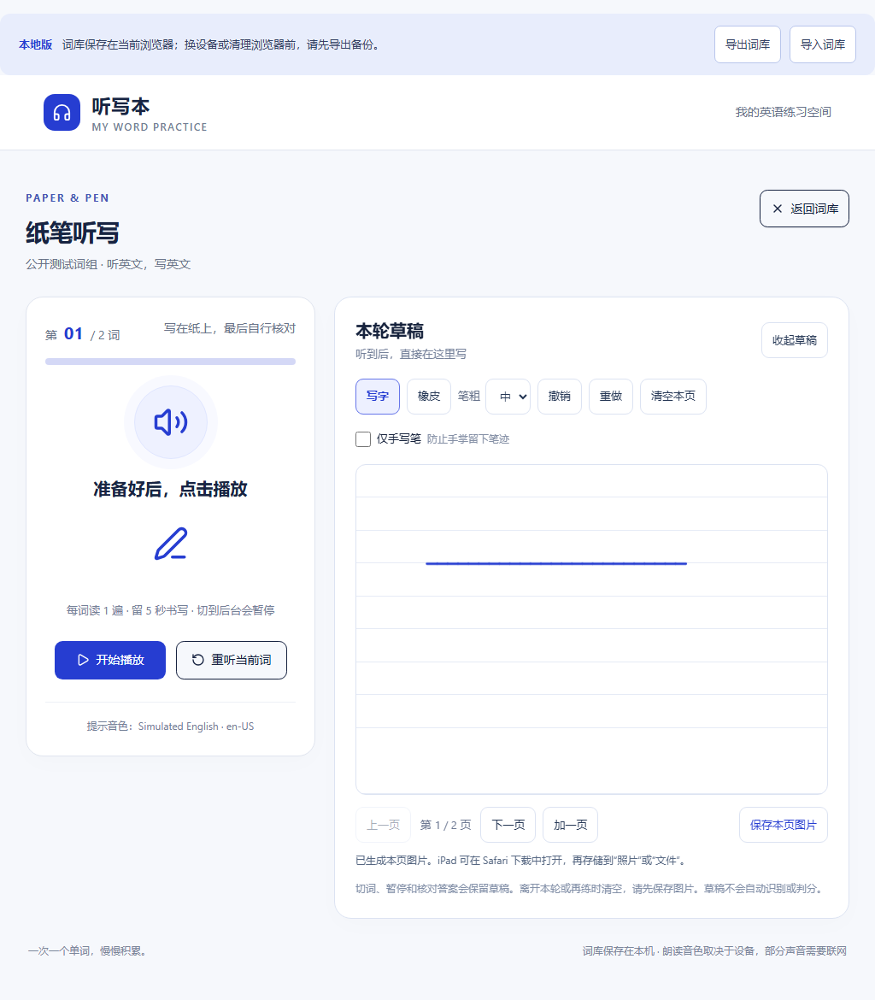
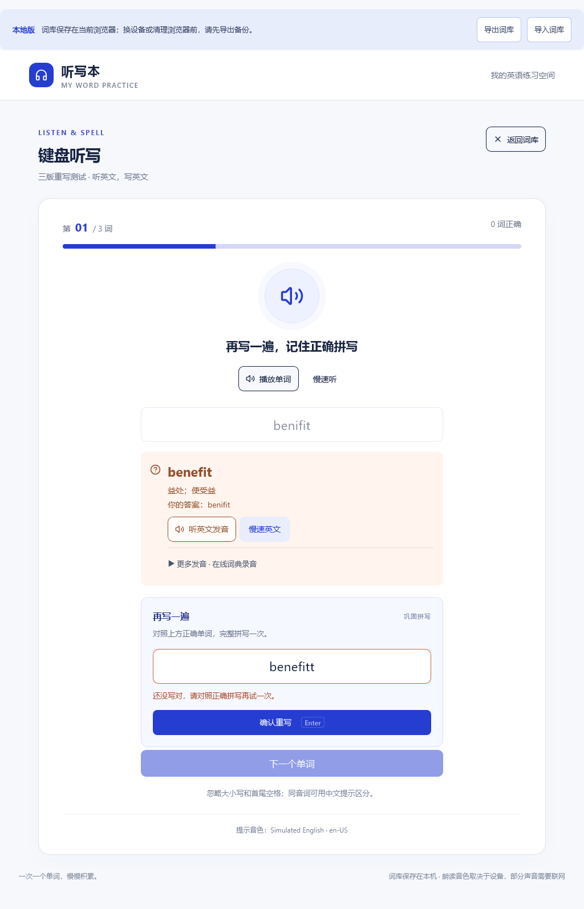

# 听写本 · 英语单词听默写

把课本单元的单词录进来，用键盘听写或纸笔听写。**单文件网页应用，可安装到 iPad / iPhone 主屏幕，装好后离线也能用。**

An offline-capable, single-file English vocabulary dictation web app (PWA) for iPad / iPhone / desktop. UI is in Chinese.

## 👉 在线使用

| 版本 | 地址 | 特点 |
| --- | --- | --- |
| **原版** | **https://hongcheng20071024-maker.github.io/tingxieben/** | 键盘听写：听到发音，输入拼写，即时批改 |
| **v2 · 草稿纸** | **https://hongcheng20071024-maker.github.io/tingxieben/v2/** | 纸笔听写：手指 / Apple Pencil 在横线纸上手写、橡皮、撤销重做、多页、保存 PNG，草稿旁带播放控制 |
| **v3 · 错词重写** | **https://hongcheng20071024-maker.github.io/tingxieben/v3/** | 键盘听写 + **答错后再写一遍**（默认开启，可关）：拼错或点「不会，查看答案」后保留原答案与正确拼写，**写对才能进入下一词**；成绩仍按第一次作答计算。同时包含 v2 的纸笔草稿纸 |

三个版本**各自独立，可以同时装三个主屏幕图标**；在同一个浏览器、同一个站点下**共用同一份本地词库**，换版本不用重新导入。
第一次用建议先联网打开原版，再联网打开要用的新版（原因见 [docs/v2草稿纸.md](docs/v2草稿纸.md) 与 [docs/v3错词重写.md](docs/v3错词重写.md)）。

<p align="center">
  
  
  
  <br>
  <sub>左：扫码打开原版（也可以截图发给同学）　中：v2 的 iPad 草稿纸　右：v3 的答错后重写</sub>
</p>

---

## 装到 iPad / iPhone

1. 用 **Safari** 打开上面的网址（必须是 Safari，微信内置浏览器不行）。
2. 点 **分享**（方框 + 向上箭头）→ **添加到主屏幕** → **添加**。
3. 主屏幕出现「听写本」图标，点开即全屏使用。

首次打开需要联网，之后离线可用（Service Worker 已缓存整站）。
如果 iPad 上找不到「分享」按钮，把 Safari 地址栏往下拉一下就会出现。

**安卓 / 电脑**：Chrome / Edge 打开同一个网址，菜单里选「安装应用」或「添加到主屏幕」。

## 词库

- 应用内可以自己增删单词，按单元（分组）管理。
- **导出 / 导入**：把词库导出成 JSON 存到「文件」App 或网盘，换设备时在新设备导入即可。
- 数据存在**你自己设备**的浏览器里（localStorage，key 为 `listen-write-library-v1`），不会上传到任何服务器。
- 原版、v2、v3 在**同一站点**下共用这份词库（localStorage 按站点共享），可以随时来回切换。
- 页面首次打开时会预置一个单元「大学英语Unit1」（27 词），仅当浏览器里还没有任何词库时写入。
- 用 AI 批量生成词库、或自己手写词库文件：格式见 **[docs/词库格式.md](docs/词库格式.md)**（内含可直接复制给 ChatGPT 的提示词模板）。

⚠️ 换设备**不会**自动同步；清理浏览器数据前请先导出备份；不要长期用无痕模式。

## 发音没声音？

朗读用的是系统语音包（Web Speech API）。没有声音时：

- **iPad**：设置 → 辅助功能 → 朗读内容 → 声音 → 英语，下载一个英语语音包。
- 应用里「更多声音与语音包」有官方指引入口。

## 目录结构

| 路径 | 说明 |
| --- | --- |
| `index.html` | **原版部署成品**（由原始源码注入 PWA 配置生成） |
| `v2/index.html` | **v2 草稿纸成品**（先生成原版成品，再把草稿纸内联进去） |
| `v2/manifest.webmanifest`、`v2/sw.js`、`v2/icon-*.png` | v2 的应用清单、离线缓存、图标（都限定在 `v2/` 目录内） |
| `v3/index.html` | **v3 错词重写成品**（由原始源码打补丁 + 注入草稿纸与订正组件生成） |
| `v3/manifest.webmanifest`、`v3/sw.js`、`v3/icon-*.png` | v3 的应用清单、离线缓存、图标（都限定在 `v3/` 目录内） |
| `source/听写本.html` | **原始单文件源码**（初版，未注入 PWA，三个版本都从它构建） |
| `source/scratchpad.js`、`source/scratchpad.css` | v2 草稿纸的源码（构建时内联） |
| `source/rewrite-spelling.js`、`source/rewrite-spelling.css` | v3 错词重写的源码（构建时内联） |
| `source/v3-patches.json` | v3 对原版 HTML 的 9 处接入补丁（每处要求恰好匹配一次） |
| `manifest.webmanifest` | PWA 清单：名称、图标、全屏模式 |
| `sw.js` | 原版 Service Worker：离线缓存（cache-first） |
| `icon-*.png` | 主屏幕图标（180 / 192 / 512 / maskable） |
| `library-backup-unit1.json` | 预置词库（大学英语 Unit1，27 词），可在应用内「导入词库」 |
| `tools/make_icons.py` | 生成图标（纯 Python，零依赖，不需要 Pillow） |
| `tools/build_site.py` | 构建原版：`source/听写本.html` → `index.html` |
| `tools/build_v2.py` | 构建 v2：先跑 `build_site.py`，再内联草稿纸 → `v2/index.html` |
| `tools/build_v3.py` | 构建 v3：校验原版 git blob 哈希 → 打 9 处补丁 → 内联订正组件与草稿纸 → `v3/index.html` |
| `tools/deploy_pages.py` | 一键发布到 GitHub Pages（走 REST API，不需要 git） |
| `tools/test_scratchpad.cjs` | v2 浏览器回归测试（Playwright，17 项 × Chromium / WebKit） |
| `tools/test_rewrite.cjs` | v3 浏览器回归测试（Playwright，11 项 × Chromium / WebKit） |
| `tests/v2-worker.test.cjs` | v2 离线缓存逻辑测试（`node tests/v2-worker.test.cjs`，无额外依赖） |
| `tests/v3-worker.test.cjs` | v3 离线缓存逻辑测试（含「不清理 v1/v2 缓存」断言） |
| `docs/词库格式.md` | 词库 JSON 格式 + 用 AI 生成词库的提示词 |
| `docs/v2草稿纸.md` | v2 说明：使用、构建、多版本共存的缓存注意事项 |
| `docs/v3错词重写.md` | v3 说明：错词重写流程、构建、验证与限制 |

## 自己部署一份

**路线 A：Fork（最省事）**

1. 点本仓库右上角 **Fork**。
2. 你 Fork 出来的仓库 → **Settings → Pages** → Source 选 **Deploy from a branch**，分支选 `main`、目录选 `/ (root)` → Save。
3. 等 1~2 分钟，访问 `https://<你的用户名>.github.io/tingxieben/`。

**路线 B：命令行（本机有 Python 就行）**

```bash
python tools/deploy_pages.py            # 需要有 GitHub 凭据（GITHUB_TOKEN 环境变量，或 git 已登录）
python tools/deploy_pages.py --repo mysite    # 换个仓库名
```

## 从源码构建

改动只发生在 `<head>`（原版）与 `<head>` + `</body>` 前（v2 / v3）：注入 PWA meta、启动脚本、草稿纸与错词订正组件，**不动原应用任何逻辑**。构建可复现 —— 同一份源码、词库、补丁与组件，每次输出完全一致。

```bash
python tools/make_icons.py       # 生成 4 个图标到仓库根目录
python tools/build_site.py       # source/听写本.html + library-backup-unit1.json → index.html
python tools/build_v2.py         # 再生成 v2/index.html（内含草稿纸）、v2/sw.js、清单与图标
python tools/build_v3.py         # 再生成 v3/index.html（内含订正组件与草稿纸）、v3/sw.js、清单与图标
node tests/v2-worker.test.cjs    # 可选：验证 v2 的离线缓存逻辑
node tests/v3-worker.test.cjs    # 可选：验证 v3 的离线缓存逻辑与版本隔离
node tools/test_rewrite.cjs      # 可选：v3 浏览器回归（需 Playwright；TEST_ENGINE=webkit 切换内核）
```

`tools/build_v3.py` 会在构建前校验 `source/听写本.html` 的 Git blob SHA1，并要求 `source/v3-patches.json` 里每处补丁**恰好匹配一次**——接入点一变就停，避免静默改错。

## 已知限制

- **更新后要刷新两次**：`sw.js` 是 cache-first（为了离线可用），改了站点内容后，老用户需要重新打开一次才会拿到新版本。
- **不要改原版 `sw.js` 的缓存清理范围**：原版 Service Worker 激活时会清掉本站点下所有非自己的缓存，**包括 v2 / v3 的离线缓存**。当前原版 `sw.js` 已冻结，所以互不影响；如果以后动了它，用户需要「先联网开原版 → 再联网开新版」才能让新版恢复离线可用（新版会在联网导航时自动补齐缺失的离线资源）。
- **v3 的开关只存在当前浏览器**：不跟随词库同步；「答错后再写一遍」只作用于**键盘听写**，「纸笔听写」不要求订正、也不识别手写答案。
- **v3 的订正不改变成绩**：本轮成绩始终按第一次作答计算，拼错的词仍留在本轮错词里，可用「只练错词」复习。
- **草稿不保存**（v2 / v3 的纸笔模式）：只在当前这一轮的内存里，切词 / 暂停 / 核对时保留，离开本轮、再练或刷新即清除；要留档就用「保存本页图片」导出 PNG（多页要逐页保存）。
- iOS 只能通过 **Safari** 添加到主屏幕；微信 / QQ 内置浏览器不支持安装。
- 词库不做云同步，靠导出 / 导入 JSON 手动搬。
- 应用本体内联了 Tailwind CSS、React 与图标库，所以 `index.html` 接近 600 KB —— 换来的是**单文件、离线可用、零依赖**。

## 许可

[MIT](LICENSE) —— 随意使用、修改、再发布，保留版权声明即可。
